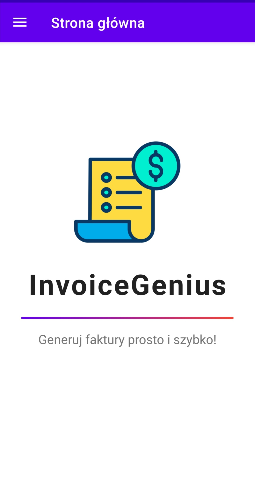

# InvoiceGenius
Welcome to InvoiceGenius! This application is designed to simplify the invoice generation process for your company. With InvoiceGenius, you can quickly and easily create professional financial documents, saving valuable time and avoiding errors.

## Features

- **Easy invoice creation:** With a simple interface, you can create and customize an invoice in just a few moments to suit your needs.
- **Data entry via form:** Data entry via a form in InvoiceGenius enables quick and precise completion of all necessary information required to generate complete financial documents.
- **Data entry via attached JSON or XML file:** Data entry via an attached file allows for quick data entry without the need to fill out additional form fields.

## Application Layout
### Home Page
The main screen layout of the application is built using `ConstraintLayout` and includes the following elements:
- **Application logo:** `ImageView` sized 150x150 dp, centered horizontally, with a 136 dp margin from the top of the screen.
- **Application name:** `TextView` with the application name, placed below the logo, with a 28 dp margin. The text is bold, with a size of 40 sp.
- **Separator:** `View` in the form of a line with a width of 300 dp and a height of 3 dp, placed below the application name with a 20 dp margin. It has a gradient background.
- **Application slogan:** `TextView` with the application's slogan, centered text with a size of 18 sp, placed below the separator with a 16 dp margin.

The entire layout is designed to be responsive, with elements centered on the screen.

### Navigation Menu
The navigation menu of the InvoiceGenius application contains the following options:

- **Home Page:** Return to the application's main screen.
- **Enter data from form:** Option to manually enter invoice data using a form.
- **Enter data from file:** Option to load invoice data from a file.

Each of these options is illustrated with an appropriate icon, making navigation and application usage easier.

### Data Entry Form
The form for entering invoice data contains the following elements:
- **10 `LinearLayout` containers** with edit fields allowing for data entry for invoices.
- **`Button` to generate invoice** triggers the activity with the invoice template.

### File Attachment Interface
The interface allowing for file attachment for processing presents:
- **Button to attach file:** `Button` allowing for the attachment of a JSON or XML file.
- **Generate button:** `Button` allowing for generation.

### Invoice Template
#### Header

- **Invoice:** This field contains the invoice number.
- **Issue Date:** The date the invoice was issued.
- **Sale Date:** The date the sale occurred.

#### Seller and Buyer

- **Seller:** Information about the seller, such as company name, address, VAT number, phone number, and bank account number.
- **Buyer:** Information about the buyer, such as company name, address, email address, and phone number.

#### Products

- **Table:** Contains a list of products sold on the invoice. Each row of the table includes the next product, along with its name, quantity, unit of measure, net price, VAT rate, VAT amount, and gross price.

#### Summary

- **Summary:** The last section contains summary amounts, such as total net price, total VAT amount, total gross price.

#### To be Paid

- **Payment Method:** Specifies how the payment should be made.
- **Payment Deadline:** The date by which payment should be made.
- **Amount to be Paid:** The total amount to be paid.

#### Signatures

- **Issued by:** Field for the seller's signature.
- **Received by:** Field for the buyer's signature.

#### Footer

- **Invoice generated by:** Information about the tool generating the invoice, for example, "InvoiceGenius."

## Business Logic of the Application

### FileFragment.kt
#### Fragment Handling File Selection and Processing

This fragment allows the user to select a file from the system's file system and then process its content depending on the file extension (.xml or .json). It also handles displaying the file content in a dialog.

##### Required Permissions
The application requires permission to read external storage to select a file.

##### Main Functions:
- File selection from the system's file system.
- Validation of the selected file for extension (.xml or .json).
- Processing the file content depending on its extension.
- Displaying the file content in a dialog.

##### Key Classes and Methods:
- `FileFragment`: Main fragment class handling file selection and processing.
- `chooseFile()`: Method initiating file selection from the system's file system.
- `validateAndDisplayFilePath(Uri)`: Method validating the selected file and displaying its path.
- `readFileContent(Uri, String)`: Method processing the file content depending on its extension (.xml or .json).
- `displayData(Map<*, *>)`: Method displaying the file content in a dialog.

### FormFragment.kt
#### Fragment Handling Invoice Creation Form

This fragment allows the user to fill out the invoice creation form, checks its validity, and transforms the input data into an invoice object. After correctly filling out the form, it opens a new activity to generate the invoice.

##### Key Functions:
- Displaying the form to fill in invoice data.
- Validation of form data.
- Converting input data to an invoice object.
- Redirecting to the invoice generation activity after correctly filling out the form.

##### Key Classes and Methods:
- `FormFragment`: Main fragment class handling the invoice creation form.
- `validateForm()`: Method validating form data.
- `showErrors(List<String>)`: Method displaying validation error messages.
- `ProductPositions`: Class representing a product position in the form.
- `getProduct()`: Method returning a product object based on data entered in the form.

### HomeFragment.kt
#### Fragment of the Main View of the Application

This fragment represents the main view of the application, which contains basic information or functions. In this case, this fragment is empty and contains no visible elements.

##### Key Functions:
- Displaying an empty view.

##### Key Classes and Methods:
- `HomeFragment`: Main fragment class representing the main view of the application.

### Buyer.kt
#### Buyer Class

This class represents the buyer in the invoicing system. It contains basic information about the buyer, such as company name, address, email address, and phone number.

##### Key Fields:
- `companyName`: Buyer's company name.
- `address`: Buyer's address.
- `email`: Buyer's email address.
- `phoneNumber`: Buyer's phone number.

### Product.kt
#### Product Class

This class represents a product that can be sold and included on an invoice. It contains basic information about the product, such as name, quantity, unit of measure, net price, and VAT rate.

##### Key Fields:
- `productName`: Product name.
- `productAmount`: Product quantity.
- `productMeasure`: Product unit of measure.
- `productPriceNetto`: Product net price.
- `vatRate`: VAT rate.

### Seller.kt
#### Seller Class

This class represents the seller in the invoicing system. It contains basic information about the seller, such as company name, address, VAT number, bank account number, and phone number.

##### Key Fields:
- `companyName`: Seller's company name.
- `address`: Seller's address.
- `nip`: Seller's VAT number.
- `bankAccountNumber`: Seller's bank account number.
- `phoneNumber`: Seller's phone number.

### InvoiceData
#### InvoiceData Class

This class represents invoice data in the invoicing system. It contains all the information needed to generate an invoice, such as information about the seller and buyer, sale and issue dates, payment information, and a list of product positions.

##### Key Fields:
- `seller`: Seller object representing the seller.
- `buyer`: Buyer object representing the buyer.
- `sellDate`: Sale date.
- `issueDate`: Invoice issue date.
- `paymentMethod`: Payment method.
- `paymentDate`: Payment date.
- `paymentTargetDate`: Payment target date.
- `products`: List of product positions.
- `invoiceNumber`: Invoice number.

### InvoiceActivity

#### InvoiceActivity

This activity is responsible for displaying the invoice based on data received via Intent. This activity displays invoice data, including seller and buyer information, product positions, and summary amounts.

##### Key Methods and Fields:

- `onCreate(Bundle)`: Method called when the activity is created, where the logic for displaying the invoice based on data passed via Intent is initiated.
- `invoiceNumberTemp`, `issueDateTemp`, `sellDateTemp`: TextViews displaying the invoice number, issue date, and sale date.
- `companyNameSellerTemp`, `addressSellerTemp`, `nipSellerTemp`, `phoneNumberSellerTemp`, `bankAccountNumberTemp`: TextViews displaying seller information.
- `companyNameBuyerTemp`, `addressBuyerTemp`, `emailBuyerTemp`, `phoneNumberBuyerTemp`: TextViews displaying buyer information.
- `priceNettoTemp`, `priceVatTemp`, `priceBruttoTemp`, `paymentMethodTemp`, `paymentTargetDateTemp`, `wholePriceTemp`, `signatureSellerTemp`: TextViews displaying amounts and payment method information.
- `productsContainer`: LinearLayout container to which product positions are added.
- `Gson()`: Gson object used for deserializing invoice data.

---

## Conclusion
InvoiceGenius is a powerful yet user-friendly tool for generating professional invoices. With features like easy form-based data entry, file attachment for batch processing, and customizable templates, it caters to the needs of small and medium-sized businesses aiming to streamline their invoicing process.
