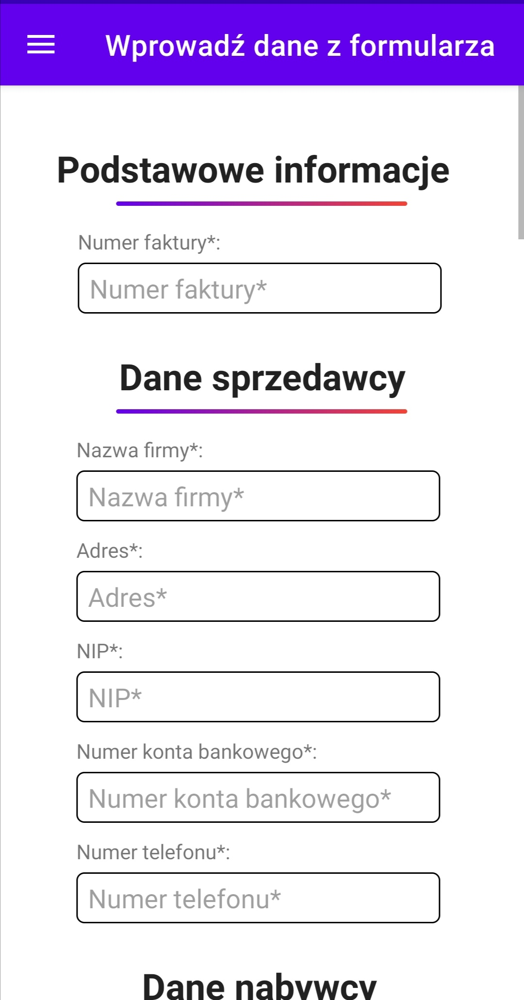
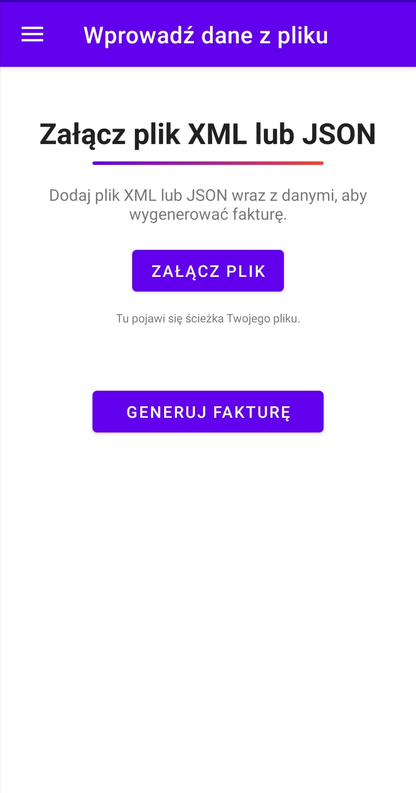

# InvoiceGenius
Witaj w InvoiceGenius! To aplikacja stworzona z myślą o ułatwieniu procesu generowania faktur dla Twojej firmy. Dzięki InvoiceGenius możesz szybko i łatwo tworzyć profesjonalne dokumenty finansowe, oszczędzając cenny czas i unikając błędów.

## Funkcje

- **Łatwe tworzenie faktur:** Dzięki prostemu interfejsowi możesz w kilka chwil stworzyć i dostosować fakturę do swoich potrzeb.
- **Wprowadzanie danych poprzez formularz:** Wprowadzanie danych poprzez formularz w InvoiceGenius umożliwia szybkie i precyzyjne uzupełnienie wszystkich niezbędnych informacji niezbędnych do wygenerowania kompletnych dokumentów finansowych.

## Layout Aplikacji
### Strona główna
Layout ekranu głównego aplikacji został zbudowany przy użyciu `ConstraintLayout` i zawiera następujące elementy:
- **Logo aplikacji:** `ImageView` o rozmiarze 150x150 dp, wyśrodkowane poziomo, z marginesem 136 dp od góry ekranu.
- **Nazwa aplikacji:** `TextView` z nazwą aplikacji, umieszczony poniżej logo, z marginesem 28 dp. Tekst jest pogrubiony, o rozmiarze 40 sp.
- **Separator:** `View` w postaci linii o szerokości 300 dp i wysokości 3 dp, umieszczony poniżej nazwy aplikacji z marginesem 20 dp. Ma gradientowe tło.
- **Slogan aplikacji:** `TextView` z hasłem aplikacji, wyśrodkowany tekst o rozmiarze 18 sp, umieszczony poniżej separatora z marginesem 16 dp.

Całość jest zaprojektowana w sposób responsywny, z elementami wyśrodkowanymi na ekranie.

### Menu nawigacyjne
Menu nawigacyjne aplikacji InvoiceGenius zawiera następujące opcje:

- **Strona główna**: Powrót do ekranu głównego aplikacji.
- **Wprowadź dane z formularza**: Opcja pozwalająca na ręczne wprowadzenie danych do faktury za pomocą formularza.
- **Wprowadź dane z pliku**: Opcja umożliwiająca załadowanie danych do faktury z pliku.

Każda z tych opcji jest zilustrowana odpowiednią ikoną, co ułatwia nawigację i użytkowanie aplikacji.

### Formularz wprowadzania danych
Formularz do wprowadzania danych do faktury zawiera następujące elementy:
- **10 kontenerów `LinearLayout`** wraz z polami edycyjnymi umożliwiającymi wprowadzanie danych do faktur.
- **`Button`do generowania faktury** wyzwala uruchomienie aktywności z szablonem faktury.

### Interfejs do załączenia pliku
Interfejs umozliwiający załączenie pliku do przetworzenia prezentuje:
- **Przycisk do załączenia pliku:** `Button` umożliwający załączenie pliku JSON lub XML
- **Przycisk do generowania:** `Button` umożliwiający generowanie.

### Szablon faktury
#### Nagłówek

- **Faktura:** Pole to zawiera numer faktury.
- **Data wystawienia:** Data, kiedy faktura została wystawiona.
- **Data sprzedaży:** Data, kiedy nastąpiła sprzedaż.

#### Sprzedawca i Nabywca

- **Sprzedawca:** Informacje dotyczące sprzedawcy, takie jak nazwa firmy, adres, NIP, numer telefonu oraz numer konta bankowego.
- **Nabywca:** Informacje dotyczące nabywcy, takie jak nazwa firmy, adres, adres e-mail oraz numer telefonu.

#### Produkty

- **Tabela:** Zawiera listę produktów sprzedanych na fakturze. Każdy wiersz tabeli obejmuje kolejny produkt, wraz z jego nazwą, ilością, jednostką miary, ceną netto, stawką VAT, kwotą VAT oraz ceną brutto.

#### Podsumowanie

- **Podsumowanie:** Ostatni fragment zawiera kwoty podsumowania, takie jak łączna cena netto, łączna kwota VAT, łączna cena brutto.

#### Do zapłaty

- **Sposób zapłaty:** Określa, w jaki sposób należy dokonać płatności.
- **Termin płatności:** Data, do której należy dokonać płatności.
- **Kwota do zapłaty:** Łączna kwota do zapłaty.

#### Podpisy

- **Wystawił:** Pole na podpis sprzedawcy.
- **Otrzymał:** Pole na podpis nabywcy.

#### Stopka

- **Faktura wygenerowana przez:** Informacja o narzędziu generującym fakturę, na przykład "InvoiceGenius".

## Logika biznesowa aplikacji

### FileFragment.kt
#### Fragment obsługujący wybór i przetwarzanie plików

Ten fragment umożliwia użytkownikowi wybór pliku z systemowego systemu plików, a następnie przetwarza jego zawartość w zależności od rozszerzenia pliku (.xml lub .json). Obsługuje również wyświetlanie zawartości pliku w formie dialogu.

##### Wymagane uprawnienia
Aplikacja wymaga uprawnienia do odczytu zewnętrznego przechowywania w celu wyboru pliku.

##### Funkcje główne:
- Wybór pliku z systemowego systemu plików.
- Walidacja wybranego pliku pod kątem rozszerzenia (.xml lub .json).
- Przetwarzanie zawartości pliku w zależności od jego rozszerzenia.
- Wyświetlanie zawartości pliku w formie dialogu.

##### Kluczowe klasy i metody:
- `FileFragment`: Główna klasa fragmentu obsługująca wybór i przetwarzanie plików.
- `chooseFile()`: Metoda inicjująca wybór pliku z systemowego systemu plików.
- `validateAndDisplayFilePath(Uri)`: Metoda walidująca wybrany plik i wyświetlająca jego ścieżkę.
- `readFileContent(Uri, String)`: Metoda przetwarzająca zawartość pliku w zależności od jego rozszerzenia (.xml lub .json).
- `displayData(Map<*, *>)`: Metoda wyświetlająca zawartość pliku w formie dialogu.

### FormFragment.kt
#### Fragment obsługujący formularz tworzenia faktury

Ten fragment pozwala użytkownikowi wypełnić formularz tworzenia faktury, sprawdza jego poprawność i przekształca dane wejściowe w obiekt faktury. Po poprawnym wypełnieniu formularza otwiera nową aktywność w celu wygenerowania faktury.

##### Kluczowe funkcje:
- Wyświetlanie formularza do wypełnienia danych faktury.
- Walidacja danych formularza.
- Konwersja danych wejściowych na obiekt faktury.
- Przekierowanie do aktywności generowania faktury po poprawnym wypełnieniu formularza.

##### Kluczowe klasy i metody:
- `FormFragment`: Główna klasa fragmentu obsługująca formularz tworzenia faktury.
- `validateForm()`: Metoda walidująca dane formularza.
- `showErrors(List<String>)`: Metoda wyświetlająca komunikat z błędami walidacji.
- `ProductPositions`: Klasa reprezentująca pozycję produktu w formularzu.
- `getProduct()`: Metoda zwracająca obiekt produktu na podstawie danych wprowadzonych w formularzu.

### HomeFragment.kt
#### Fragment głównego widoku aplikacji

Ten fragment reprezentuje główny widok aplikacji, który zawiera podstawowe informacje lub funkcje. W tym przypadku, fragment ten jest pusty i nie zawiera żadnych widocznych elementów.

##### Kluczowe funkcje:
- Wyświetlanie pustego widoku.

##### Kluczowe klasy i metody:
- `HomeFragment`: Główna klasa fragmentu reprezentującego główny widok aplikacji.

### Buyer.kt
#### Klasa Buyer

Ta klasa reprezentuje kupującego w systemie fakturowania. Zawiera podstawowe informacje o kupującym, takie jak nazwa firmy, adres, adres e-mail i numer telefonu.

##### Kluczowe pola:
- `companyName`: Nazwa firmy kupującego.
- `address`: Adres kupującego.
- `email`: Adres e-mail kupującego.
- `phoneNumber`: Numer telefonu kupującego.

### Product.kt
#### Klasa Product

Ta klasa reprezentuje produkt, który może być sprzedawany i uwzględniany na fakturze. Zawiera podstawowe informacje o produkcie, takie jak nazwa, ilość, jednostka miary, cena netto oraz stawka podatku VAT.

##### Kluczowe pola:
- `productName`: Nazwa produktu.
- `productAmount`: Ilość produktu.
- `productMeasure`: Jednostka miary produktu.
- `productPriceNetto`: Cena netto produktu.
- `vatRate`: Stawka podatku VAT.

### Seller.kt
#### Klasa Seller

Ta klasa reprezentuje sprzedawcę w systemie fakturowania. Zawiera podstawowe informacje o sprzedawcy, takie jak nazwa firmy, adres, numer NIP, numer konta bankowego i numer telefonu.

##### Kluczowe pola:
- `companyName`: Nazwa firmy sprzedawcy.
- `address`: Adres sprzedawcy.
- `nip`: Numer NIP sprzedawcy.
- `bankAccountNumber`: Numer konta bankowego sprzedawcy.
- `phoneNumber`: Numer telefonu sprzedawcy.

### InvoiceData
#### Klasa InvoiceData

Ta klasa reprezentuje dane faktury w systemie fakturowania. Zawiera wszystkie informacje potrzebne do wygenerowania faktury, takie jak informacje o sprzedawcy i kupującym, daty sprzedaży i wystawienia faktury, informacje o płatności oraz lista pozycji produktów.

##### Kluczowe pola:
- `seller`: Obiekt Seller reprezentujący sprzedawcę.
- `buyer`: Obiekt Buyer reprezentujący kupującego.
- `sellDate`: Data sprzedaży.
- `issueDate`: Data wystawienia faktury.
- `paymentMethod`: Metoda płatności.
- `paymentDate`: Data płatności.
- `paymentTargetDate`: Data docelowa płatności.
- `products`: Lista pozycji produktów.
- `invoiceNumber`: Numer faktury.

### InvoiceActivity
#### Aktywność InvoiceActivity

Ta aktywność jest odpowiedzialna za wyświetlanie faktury na podstawie danych otrzymanych przez Intent. Aktywność ta wyświetla dane faktury, w tym informacje o sprzedawcy i kupującym, pozycje produktów oraz podsumowanie kwotowe.

##### Kluczowe metody i pola:
- `onCreate(Bundle)`: Metoda wywoływana przy tworzeniu aktywności, w której inicjowana jest logika wyświetlania faktury na podstawie danych przekazanych przez Intent.
- `invoiceNumberTemp`, `issueDateTemp`, `sellDateTemp`: TextViews wyświetlające numer faktury, datę wystawienia i datę sprzedaży.
- `companyNameSellerTemp`, `addressSellerTemp`, `nipSellerTemp`, `phoneNumberSellerTemp`, `bankAccountNumberTemp`: TextViews wyświetlające informacje o sprzedawcy.
- `companyNameBuyerTemp`, `addressBuyerTemp`, `emailBuyerTemp`, `phoneNumberBuyerTemp`: TextViews wyświetlające informacje o kupującym.
- `priceNettoTemp`, `priceVatTemp`, `priceBruttoTemp`, `paymentMethodTemp`, `paymentTargetDateTemp`, `wholePriceTemp`, `signatureSellerTemp`: TextViews wyświetlające informacje dotyczące kwot oraz metody płatności.
- `productsContainer`: Kontener LinearLayout, do którego dodawane są pozycje produktów.
- `Gson()`: Obiekt Gson służący do deserializacji danych faktury.

### MainActivity.kt
#### Klasa MainActivity

Ta klasa jest główną aktywnością aplikacji. Odpowiada za zarządzanie nawigacją między fragmentami za pomocą panelu nawigacyjnego (NavigationView) oraz ustawianie paska akcji (ActionBar) zgodnie z bieżącym fragmentem.

##### Kluczowe metody i pola:
- `onCreate(Bundle)`: Metoda wywoływana przy tworzeniu aktywności, w której inicjowane są elementy interfejsu użytkownika oraz konfiguracja nawigacji.
- `onCreateOptionsMenu(Menu)`: Metoda do tworzenia menu akcji.
- `onSupportNavigateUp()`: Metoda wywoływana, gdy użytkownik naciska przycisk powrotu na pasku akcji, służy do nawigacji do poprzedniego ekranu.
- `appBarConfiguration`: Konfiguracja paska akcji zgodnie z dostępnymi fragmentami.
- `binding`: Obiekt klasy ActivityMainBinding, służący do powiązania elementów interfejsu użytkownika z kodem.

**Podsumowanie:**

Projekt "InvoiceGenius" dostarcza użyteczne narzędzie do zarządzania fakturami, umożliwiając łatwe tworzenie, przeglądanie i edycję dokumentów finansowych.

**Osiągnięcia:**

- Interaktywny interfejs użytkownika dla szybkiego dostępu do funkcji fakturacji.
- Mechanizm walidacji danych zapewniający poprawność wprowadzonych informacji.
- Funkcja generowania faktur z automatycznym obliczaniem kwot i stawek VAT.
- Responywna nawigacja między fragmentami ułatwiająca korzystanie z aplikacji.
